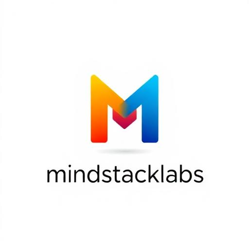

# MindStackLabs - AI-Powered Learning & Development Platform



## 🌟 Overview

**MindStackLabs** is a comprehensive AI-powered educational and development platform designed for students, educators, and professionals. It combines cutting-edge AI capabilities with interactive learning tools, including virtual laboratories, AI workspaces, and professional CAD software—all accessible through a modern, responsive web interface. Also Its currently under development or the prototype is available at [MindStackLabs](https://mindstacks.lovable.app).

Note: Some features may not work perfectly or bugs can be noticed as it is under Development.

---

## 📄 Pages & Features

### 1. **Landing Page** (`/`)
The central hub for user interaction with the AI assistant.
- **Features:** AI Chat Interface, Voice Input, File Attachments, Web Search Toggle, Deep Think Mode.

### 2. **AI Workspace** (`/workspace`)
Full-featured AI conversation environment with persistent chat history.
- **Features:** Persistent Conversations, Web Search Integration, Streaming Responses, Source Display.

### 3. **Coderx - AI Coding Environment** (`/codex`)
Professional IDE with AI-assisted coding and live execution.
- **Features:** Dual Mode Sandbox (E2B & Lite), File Explorer, Integrated Terminal, AI Code Assistant.

### 4. **Virtual CAD** (`/virtual-cad`)
Professional-grade 2D CAD application for technical drawings.
- **Features:** Drawing Tools (Line, Circle, etc.), Precision Features (Snap, Ortho), Layer Management.

### 5. **Virtual Chemistry Lab** (`/chemistry-lab`)
Interactive EDTA titration simulation for water hardness determination.
- **Features:** Realistic Lab Equipment, Titration Simulation, AI Lab Assistant, PDF Export.

### 6. **Authentication** (`/auth`)
Secure login and registration system with Email/Password and Google OAuth.

### 7. **Profile** (`/profile`)
User account management for avatar and display name updates.

---

## 🛠️ Technology Stack

| Category | Technologies |
|----------|--------------|
| **Frontend** | React 18, TypeScript, Vite |
| **Styling** | Tailwind CSS, Framer Motion |
| **UI Components** | Shadcn UI, Radix UI Primitives |
| **State Management** | React Query, React Hooks |
| **Backend** | Supabase (Lovable Cloud) |
| **Database** | PostgreSQL with RLS |
| **Authentication** | Supabase Auth, Google OAuth |
| **AI Integration** | OpenAI/Gemini via Edge Functions |
| **Code Sandbox** | E2B, StackBlitz SDK |
| **PDF Generation** | jsPDF, jsPDF-AutoTable |

---

## 🏗️ Architecture

```
┌─────────────────────────────────────────────────────────────┐
│                      Frontend (React + Vite)                │
│  ┌──────────┐ ┌──────────┐ ┌──────────┐ ┌──────────────────┐│
│  │  Landing │ │Workspace │ │  Codex   │ │  Chemistry Lab   ││
│  │   Page   │ │          │ │          │ │                  ││
│  └────┬─────┘ └────┬─────┘ └────┬─────┘ └────────┬─────────┘│
│       │            │            │                │          │
│  ┌────┴────────────┴────────────┴────────────────┴─────────┐│
│  │              Supabase Client (Auth + DB)                ││
│  └────────────────────────────┬────────────────────────────┘│
└───────────────────────────────┼─────────────────────────────┘
                                │
                                ▼
┌───────────────────────────────────────────────────────────────┐
│                     Lovable Cloud (Supabase)                  │
│  ┌─────────────┐ ┌─────────────┐ ┌─────────────────────────┐  │
│  │  Auth       │ │  Database   │ │    Edge Functions       │  │
│  │  (JWT)      │ │  (Postgres) │ │  ┌─────────────────────┐│  │
│  └─────────────┘ └─────────────┘ │  │ ai-chat             ││  │
│                                  │  │ codex-ai            ││  │
│  ┌─────────────┐                 │  │ web-search          ││  │
│  │  Storage    │                 │  │ e2b-sandbox         ││  │
│  │  (Files)    │                 │  └─────────────────────┘│  │
│  └─────────────┘                 └─────────────────────────┘  │
└───────────────────────────────────────────────────────────────┘
```

